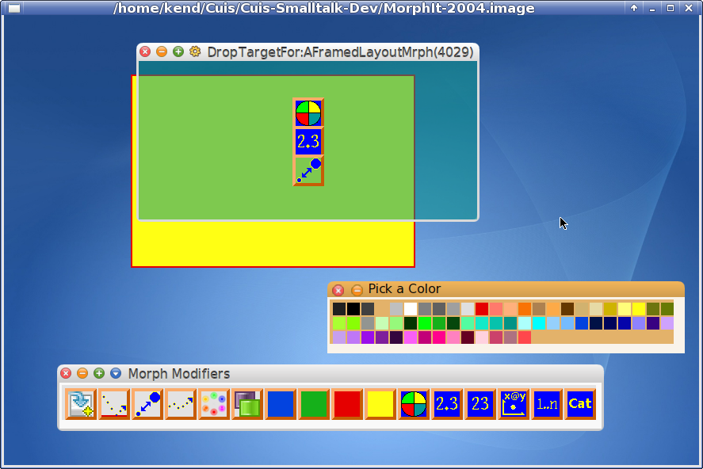

Cuis-Smalltalk-BabySteps
==========

Random package code under development and proof-of-concept prototypes

Pre-alpha, but feel free to look.

To load a package
````Smalltalk
	Feature require: '<whatever>'
````

Of possible interest is the MorphIt package, which is a start at drag-n-drop behaviors for individual morphs.
````Smalltalk
	Feature require: #'MorphIt'.

	MorphModifierPallet initializedInstance openInWorld morphExtent:  (690 @ 84).

````
File in '2400-CuisCore-ForMorphIt-2015Jul05-15h34m-KenD.2.cs.st'

Now select a Morph, from the halo's Menu select 'show drop target for me'
Then click+drag from the MorphModifierPallet to the DropTarget.

E.g. drag the Color Cycle icon (tool help will show this) to the drop target; move the DropTarget aside; move the mouse over the original morph.

Drop "Follow a Path" onto the DropTarget.  When clicked, the target morph will do a little dance as it follows a path.



WHERE AM I GOING WITH THIS?

MorphIt is my start at moving UI building to be more media centric.  It ia a proof-of-concept.

The basic idea is that there are a bunch of pallets which allow one to add and compose individual  morphs, their properties and behaviors.  More direct authoring.  

Ideas are inspired from multimedia authoring environments like SK8 and mTropolis (RIP; Note files in directory IdeaMine).

The observation is that UI events are rare and don't have to be especially fast.

The current implementation is just a sketch and uses Morph properties.  A DropTarget is used to add (and eventually remove) MorphActions and so forth.  This keeps Morps themselves free of editing entanglements.


DIRECTIONS / ROAD MAP

Property sheets -- Edit a Morph's properties.  This could be constrained to allow one to drop a morph or type a name/value or select from a list or pop-up a specialized editor.  For example, a property constrained to hold colors would accept a color swatch, color name, or pop-up a color editor or color pallet.

Morph environment -- I would like to add UI behaviors to individual morphs.  The idea is to add event/message handlers for drop-actions in an editor which could constrain/check arguments.  Method variables not local would be looked up in the Morph's UI environment -- stored in a #MorphEnv property.  Think Workspace environments.  This would allow sharing between different handlers in an individual morph.

Save / Clone Composits -- I would like to be able to build things like scroll bars, 'fuse' the result into a Composit, then add that new composit to a PartsBin Pallet to clone copies for further editing.

Scene based Asset Management -- When your actor goes through that door the scene changes.  In a media rich environment, memory large media should be cached and flushed or staged in as required.

StoryBord Editor -- To manage rooms/scenes/locales and the portals and transitions between them.


QUESTIONS TO ANSWER

Can one hide the differences between properties and ivars and basically treat them the same?

How best to add constraints to properties/ivars?  Property sheet metadata?  Pharo-like first class slots?

Can one use Scratch-like script elements to maximise the "direct construction" experience and minimise typing?  What is the most clear separation between adding/specializing scripts and Smalltalk code components?


Lots of fun here!  ;^)
